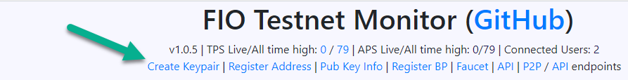
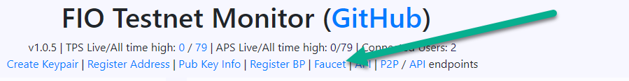
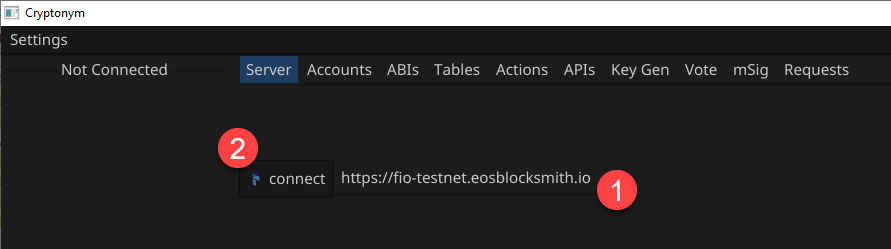
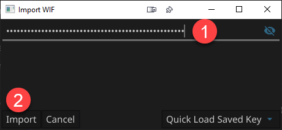
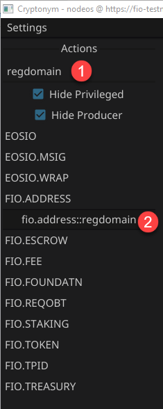
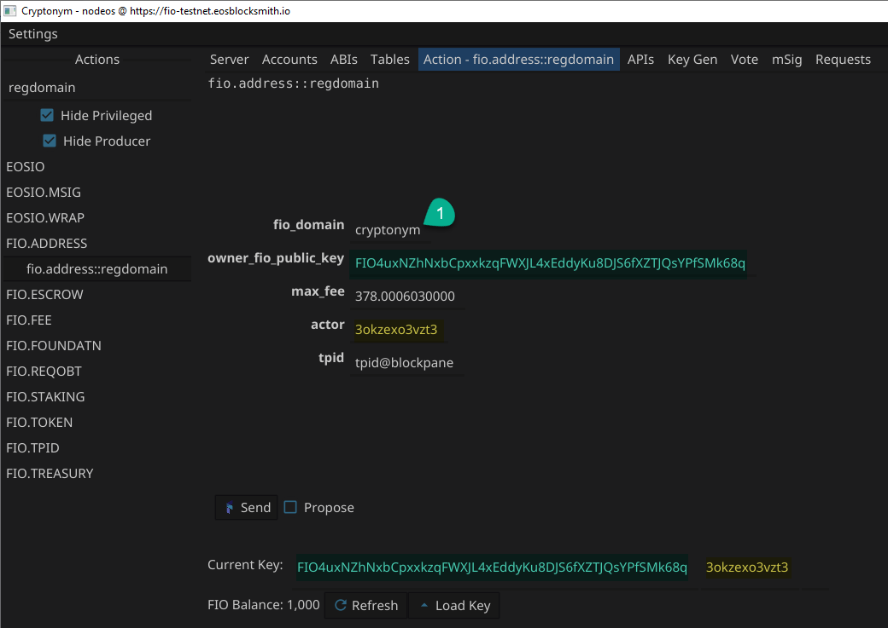
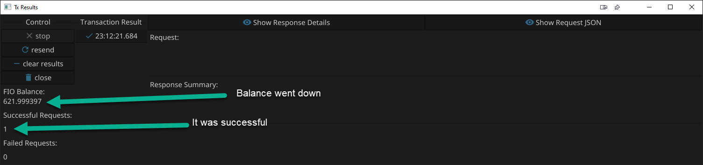
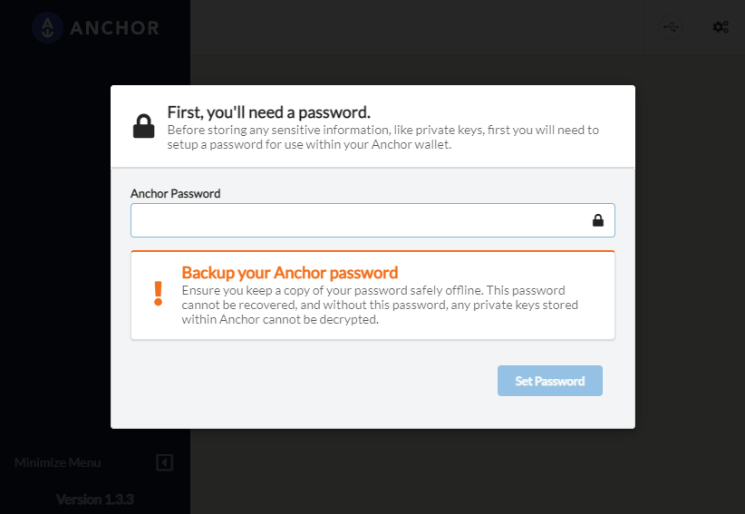
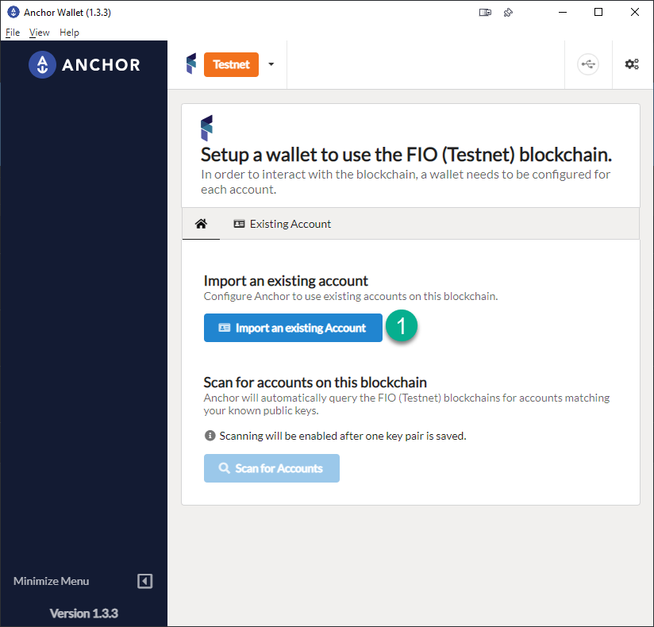
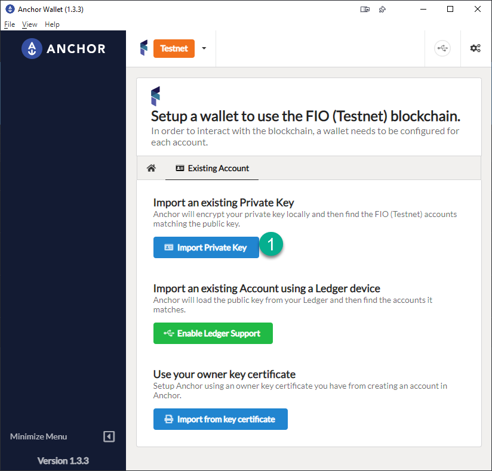

# How to use the FIO Domain Marketplace

## Create a keypair
We are going create a brand new account and register a domain so it can be listed for sale on the marketplace.

Visit the FIO Testnet Monitor https://monitor.testnet.fioprotocol.io and click "Create Keypair"



Copy the 3 pieces of information from the popup window, the **Public Key**, **Private Key**, and **actor name**.

```
Public Key: FIO4uxNZhNxbCpxxkzqFWXJL4xEddyKu8DJS6fXZTJQsYPfSMk68q
Private key: 5JzsRFUnV8T99qjzPaevr9FsrpTAbBsAM4VLMNQJswNppYr8GfH

FIO Internal Account (actor name): 3okzexo3vzt3
```

`DO NOT USE THIS KEY, IT IS JUST FOR DEMO PURPOSES`

## Get Coins from Faucet
Click on the Faucet link


1. Copy the public key you saved from above, it starts with **FIO** and paste it in the _Pub Key_ field.
2. Click _I'm not a robot_ and pass the captcha
3. Click _Send Coins_.
   

The faucet only works every 6 hours per address. You are able to create multiple addresses and get free tokens per address.

## Set up Cryptonym
There are a few ways to do this. We can use bloks.io, but that doesn't seem to work right now. If you have access to _nodeos_ you can do it on the command line. The way we're going to do it is using a tool called Cryptonym.

Download Crypotonym for Mac and Windows here https://github.com/blockpane/cryptonym/releases. 1.0.4 is the latest version.

When you open Cryptonym it should look something like this:
Fill out `https://fio-testnet.eosblocksmith.io` and click __connect__.


There is a provided list of servers but those are for mainnet, we need to be on testnet so using the url above is the way to do that.

A lot is going on with Cryptonym but we just need to do a few things. First thing is to __Load Key__ towards the bottom middle. In the pop up window you're going to paste the private key (it starts with __5__) and click _Import_



You'll notice a few things change, like _Current Key_ and the _FIO Balance_, which confirms it was changed and loaded properly.

On the left side where it says _Filter Actions_ type `regdomain`. This will filter the action list to only include the regdomain action. Click on `fio.address::regdomain`



## Register FIO Domain

Some data is already filled out but we need to change some of it.

The __owner_fio_public_key__ and __actor__ should both be auto filled with the key that you loaded in a previous step, verify they match.

The _max_fee_ is auto filled and should stay as it is.

The only thing that should need to be changed is __fio_domain__. You can choose just about anything, I would make it as unique as possible because many domains will already be taken.



#### The result window looks like this


## Setup Anchor Wallet

Download Anchor wallet for your OS. I will go over Windows, but it is a similar process on other OS's. The latest version is __1.3.3__.


Click __Setup an Account__

Set a secure password that you will remember but that is hard to guess. This password will give access to all the private keys stored in Anchor. It is important this is a secure password and stored safely.



We're going to choose _FIO (Testnet)_. To do this, (1) tick the checkbox _Show blockchain test networks_ then (2) click on the drop down menu and scroll to (3) _FIO (Testnet)_ and select it.

Click _Import an existing Account_


Click _Import Private Key_


(1) Paste the private key saved earlier (it starts with a __5__).

Anchor will detect the public key and (2) show the accounts associated with that public/private keypair. (3) select the __@active__ account on the list and then (4) click __Import Account(s)__. You will be prompted for the password you created in the previous step.

## List domain for sale
Navigate to https://fiomarket.place
