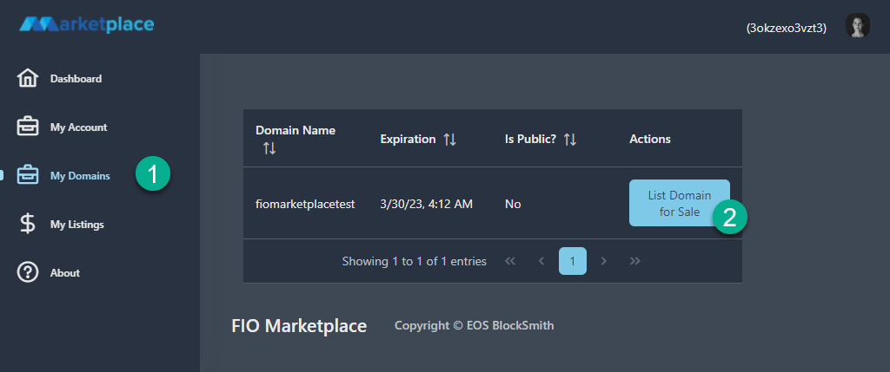

# How to use the FIO Domain Marketplace

## Create a keypair
We are going create a brand new account and register a domain so it can be listed for sale on the marketplace.

Visit the FIO Testnet Monitor https://monitor.testnet.fioprotocol.io and click "Create Keypair"


Copy the 3 pieces of information from the popup window, the **Public Key**, **Private Key**, and **actor name**.

```
Public Key: FIO4uxNZhNxbCpxxkzqFWXJL4xEddyKu8DJS6fXZTJQsYPfSMk68q
Private key: 5JzsRFUnV8T99qjzPaevr9FsrpTAbBsAM4VLMNQJswNppYr8GfH

FIO Internal Account (actor name): 3okzexo3vzt3
```

`DO NOT USE THIS KEY, IT IS JUST FOR DEMO PURPOSES`

## Get Coins from Faucet
Click on the Faucet link


1. Copy the public key you saved from above, it starts with **FIO** and paste it in the _Pub Key_ field.
2. Click _I'm not a robot_ and pass the captcha
3. Click _Send Coins_.


The faucet only works every 6 hours per address. You are able to create multiple addresses and get free tokens per address.

## Set up Cryptonym
There are a few ways to do this. We can use bloks.io, but that doesn't seem to work right now. If you have access to _nodeos_ you can do it on the command line. The way we're going to do it is using a tool called Cryptonym.

Download Crypotonym for Mac and Windows here https://github.com/blockpane/cryptonym/releases. 1.0.4 is the latest version.

When you open Cryptonym it should look something like this:
Fill out `https://fio-testnet.eosblocksmith.io` and click __connect__.


There is a provided list of servers but those are for mainnet, we need to be on testnet so using the url above is the way to do that.

A lot is going on with Cryptonym but we just need to do a few things. First thing is to __Load Key__ towards the bottom middle. In the pop up window you're going to paste the private key (it starts with __5__) and click _Import_


You'll notice a few things change, like _Current Key_ and the _FIO Balance_, which confirms it was changed and loaded properly.

On the left side where it says _Filter Actions_ type `regdomain`. This will filter the action list to only include the regdomain action. Click on `fio.address::regdomain`


## Register FIO Domain

Some data is already filled out but we need to change some of it.

The __owner_fio_public_key__ and __actor__ should both be auto filled with the key that you loaded in a previous step, verify they match.

The _max_fee_ is auto filled and should stay as it is.

The only thing that should need to be changed is __fio_domain__. You can choose just about anything, I would make it as unique as possible because many domains will already be taken.


#### The result window looks like this


## Setup Anchor Wallet

Download Anchor wallet for your OS. I will go over Windows, but it is a similar process on other OS's. The latest version is __1.3.3__.


Click __Setup an Account__

Set a secure password that you will remember but that is hard to guess. This password will give access to all the private keys stored in Anchor. It is important this is a secure password and stored safely.


We're going to choose _FIO (Testnet)_. To do this, (1) tick the checkbox _Show blockchain test networks_ then (2) click on the drop down menu and scroll to (3) _FIO (Testnet)_ and select it.

Click _Import an existing Account_


Click _Import Private Key_


(1) Paste the private key saved earlier (it starts with a __5__).

Anchor will detect the public key and (2) show the accounts associated with that public/private keypair. (3) select the __@active__ account on the list and then (4) click __Import Account(s)__. You will be prompted for the password you created in the previous step.

On the Account(s) Overview page it should now show the FIO account in the list and at the top of the UI.


## Use FIO Marketplace
This site is currently not very mobile friendly. It is highly recommended to use a computer when interacting with the FIO Marketplace. Please note this website is in active development so things might look different compared to the screenshots or instructions because of ongoing updates.

Navigate to https://fiomarket.place

Click the top right corner and then "Log In"


You will get a popup window with a large QR code. Click on "Launch Anchor" at the bottom.


You will get yet another pop up window "Open Anchor Wallet?". This will popup when ever you login to the site. Tick the checkbox to "Always allow..." if you don't want to have this popup every time. Click on "Open Anchor Wallet"


The next window that pops up is a __Signing Request__. Verify the account in the middle of the screen is the one you want to use (this is handy if you have multiple accounts set up) then click the blue lock icon in the bottom right, you'll be prompted for your anchor password. 


There is a bug that doesn't refresh the page right away sometimes so if nothing changes please refresh the page and the left-side links should show up. 

Click "My Domains" and you should see the domain you registered earlier. To list it for sale click "List Domain for Sale".



On this page you can set the price you want for the domain. Remember you paid around 380 FIO to register it so you probably don't want to go less than that. I will list mine for 425 FIO. When I enter the price some information appears breaking down the costs for listing and the commission the marketplace takes out. Currently it's a _3% commission_ and _5 FIO_ listing fee. When the domain sells, I'll receive 388 FIO out of the 400. The 5 FIO is taken at the time of listing. 

Click _Confirm_ when you're satisfied with the amount of FIO you will receive for the domain.


Another signing request window will popup detailing the information about the domain being listed for sale. Click the green pencil icon to sign the transaction.


The domain will now show up on the _My Listings_ page with details about the listing. You are able to cancel the listing from this page. 


(1) It also shows up on the dashboard page.

You will notice that because you are the one listing the domain, the 'Buy Now' button is disabled. This is because you cannot buy a domain you listed yourself with the same account.

(2) You can also purchase a domain from this page. Click "Buy Now" on any domain.


The purchase page summarizes the domain being purchased and for how much. 


Clicking "Buy" will pop up another _Signing Request_ window with a summary of the purchase information. Click the green pencil icon in the bottom right corner to purchase the domain.


